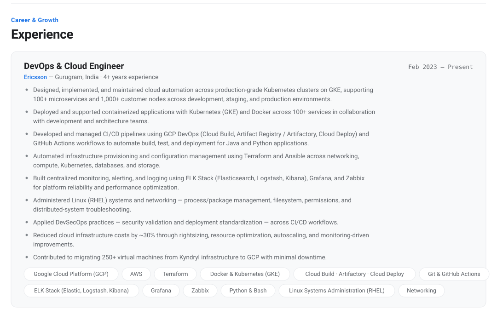
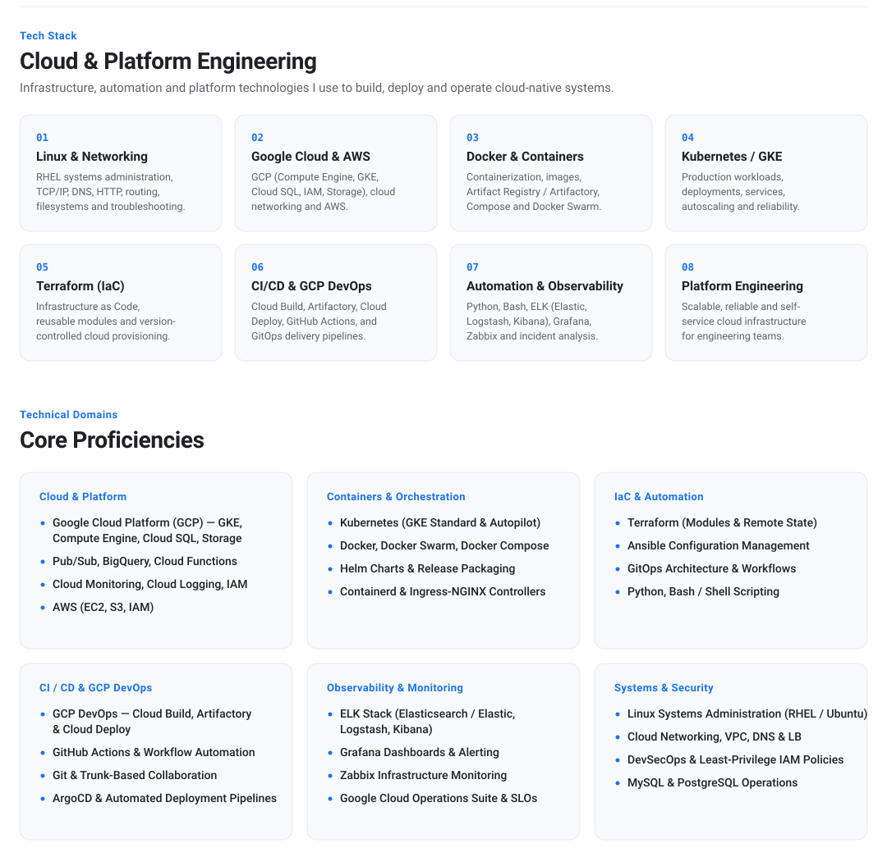
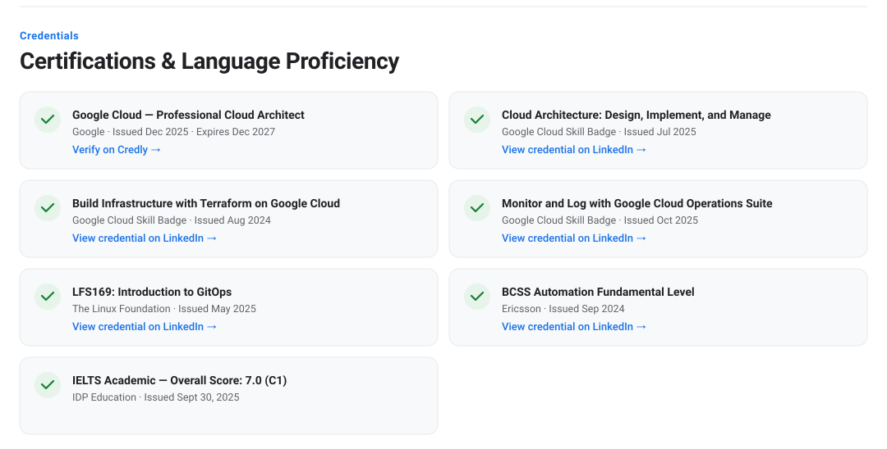
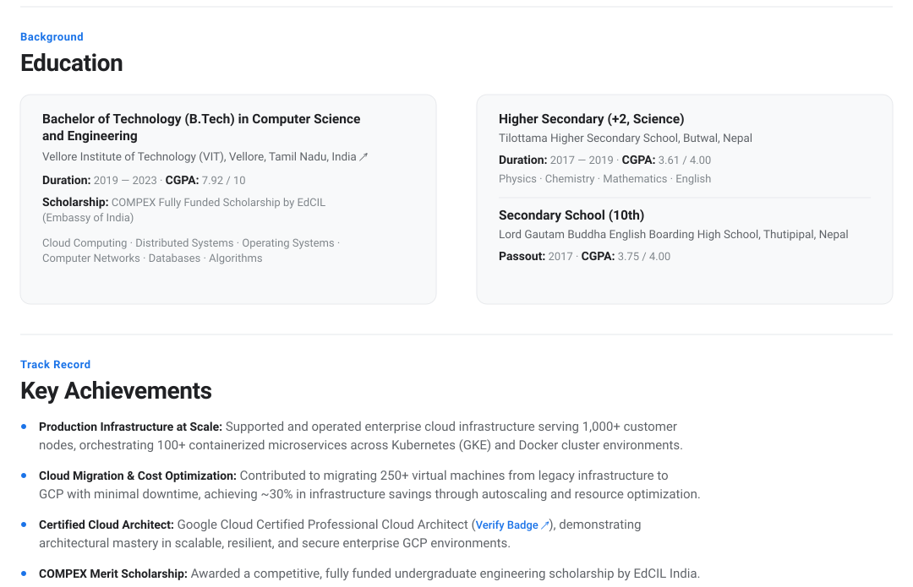
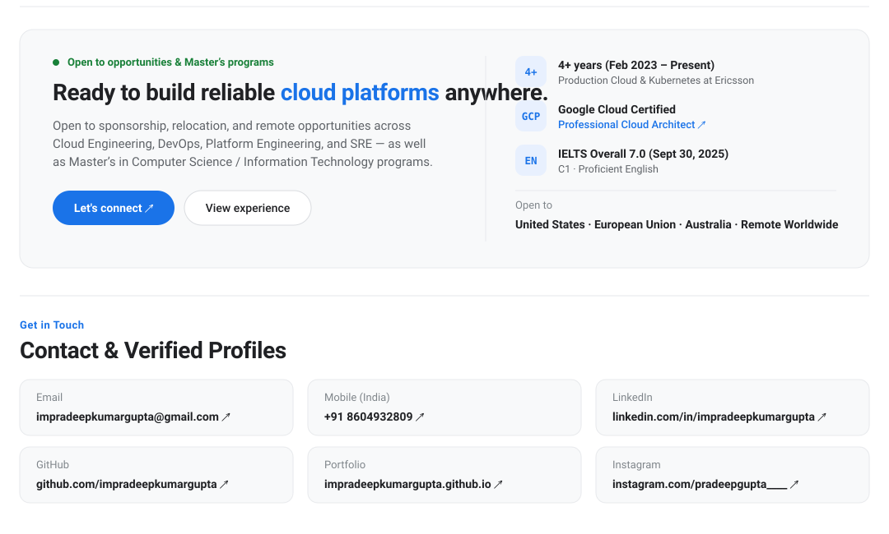

  <!-- 1. HERO UI (Exact CSS Render: Eyebrow, Title, Summary, Pill Buttons & Framed Portrait) -->
  

  <!-- 2. EXPERIENCE UI (Ericsson Card + Pill Tech Chips) -->
  

  <!-- 3. CLOUD & PLATFORM ENGINEERING PIPELINE (8-Card Grid) + CORE PROFICIENCIES (6-Card Grid) -->
  

  <!-- 4. CERTIFICATIONS & LANGUAGE PROFICIENCY (2-Column Card Grid with Green Check Badges) -->
  

  <!-- 5. EDUCATION (2-Column Card Grid with Nested Secondary School) & KEY ACHIEVEMENTS -->
  

  <!-- 6. AVAILABILITY CARD & VERIFIED CONTACT CARDS -->
  

   
  

    <a href="mailto:impradeepkumargupta@gmail.com">Email</a> ·
    <a href="tel:+918604932809">+91 8604932809</a> ·
    <a href="https://linkedin.com/in/impradeepkumargupta">LinkedIn</a> ·
    <a href="https://github.com/impradeepkumargupta">GitHub</a> ·
    <a href="https://impradeepkumargupta.github.io/">Portfolio</a> ·
    <a href="https://instagram.com/pradeepgupta____">Instagram</a>
  

  © 2026 Pradeep Kumar Gupta

